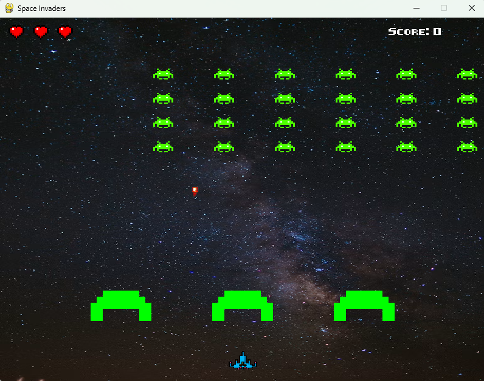

# Space Invaders 🎮

A classic **Space Invaders** game built with **Python** and **Pygame**.

This project was created as a learning project to practice game development concepts such as game loops, keyboard input, collision detection, animations, lists, and game states.

## Screenshot



## Features

* 🚀 Player spaceship movement
* 👾 Multiple rows of aliens
* 🔫 Player shooting
* 💣 Alien attacks with bombs
* 🛡️ Destructible barriers
* 💥 Explosion animations
* ❤️ Three player lives
* ⭐ Score system
* 🏆 Win condition
* 💀 Game Over condition
* 🔄 Restart after Game Over or winning
* 🎵 Background music
* 🕹️ Pixel-style font

## Controls

| Key       | Action                            |
| --------- | --------------------------------- |
| `←`       | Move left                         |
| `→`       | Move right                        |
| `Space`   | Shoot                             |
| `Any key` | Restart after Game Over / You Win |
| `X`       | Exit game                         |


## Technologies

* **Python**
* **Pygame**

## Project Structure

```text
Space_Invaders_Game/
│
├── images/
│   ├── alien.png
│   ├── background.png
│   ├── bombs.png
│   ├── explosion_1.png
│   ├── explosion_2.png
│   ├── explosion_3.png
│   ├── explosion_4.png
│   ├── explosion_5.png
│   ├── explosion_6.png
│   ├── game_over.png
│   ├── heart_life.png
│   └── spaceship.png
│
├── sounds/
│   └── spaceinvaders_song.mpeg
│
├── fonts/
│   └── 8bit_font.ttf
│
└── main.py
```

## What I Practiced

Through this project I practiced:

* Creating a Pygame window and game loop
* Working with `pygame.Rect`
* Keyboard input and player movement
* Collision detection with `colliderect()`
* Managing objects using Python lists
* Creating and removing objects during gameplay
* Creating simple animations
* Using game states such as **running**, **game_over**, and **game_won**
* Creating a restartable game using a `reset_game()` function
* Working with images, fonts and sounds in Pygame

## Future Improvements

Possible future additions:

* Multiple levels
* Increasing alien speed
* Different types of aliens
* High-score saving
* Sound effects for shooting and explosions
* More advanced enemy attack patterns
* Start menu and pause menu
